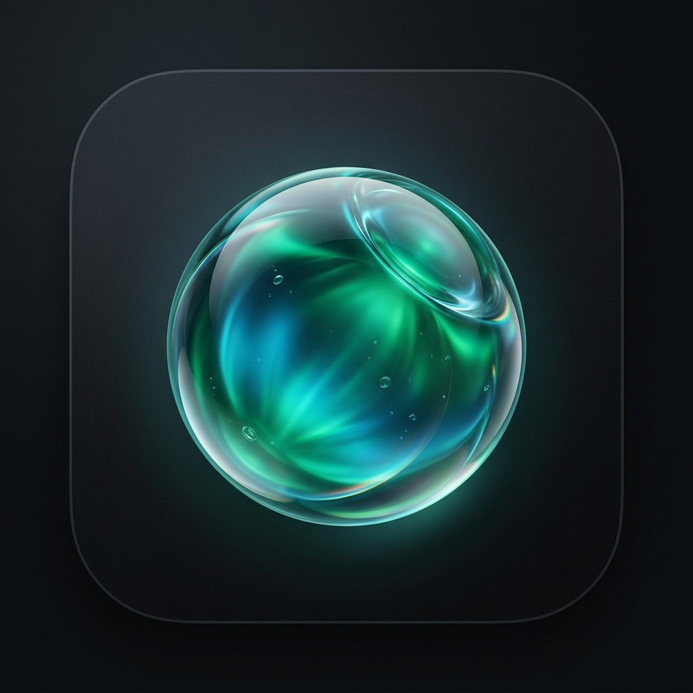

# Lume — New Tab Extension

> A sleek, beautiful new tab experience with a live Now Island, clock, daily quotes, weather, custom dock, and stunning rotating backgrounds.



---

## ✨ Features

- **Now Island** — a live dynamic pill at the top showing clock, greeting, and cycling info
- **Daily Quotes** — curated quote collections with custom import support (JSON, CSV, plain text)
- **Weather Widget** — live weather with auto or manual location
- **Custom Dock** — pin your most-visited sites, favorites, or bookmarks
- **Rotating Backgrounds** — Unsplash photography, gradients, or solid colors — with true random color generation per tab
- **Draggable Widgets** — rearrange everything on the page to your preference
- **Full Settings Panel** — General, Widgets, Quotes, Display, Appearance, and About

---

## 🚀 Installation

### Chrome Web Store
*(Coming soon)*

### Manual / Developer Install
1. Clone or download this repo
2. Open `chrome://extensions` (or `edge://extensions`)
3. Enable **Developer Mode**
4. Click **Load unpacked** and select this folder

---

## 📁 Project Structure

```
lume/
├── early.js         ← Instant pre-boot theme applier (zero flash)
├── index.html       ← Main new tab page
├── manifest.json    ← Chrome MV3 manifest
├── quotes.js        ← Built-in quote collections (~412 quotes)
├── script.js        ← All extension logic
├── style.css        ← Full design system & styles
├── wallpapers.js    ← Curated Unsplash wallpaper collections
├── fonts/           ← Local font assets
├── icons/           ← Extension icons (16, 32, 48, 128px)
└── LICENSE
```

---

## 🎨 Data & API Credits
 
| Service | Use |
|---------|-----|
| [Unsplash](https://unsplash.com) | Background photography (API Attribution) |
| [Open-Meteo](https://open-meteo.com) | Weather data (CC BY 4.0 Attribution) |

---

## ☕ Support

- ⭐ [Star on GitHub](https://github.com/praiseifenkwe/lume)
- 𝕏 [Follow on X](https://x.com/praise_ifenkwe)
- ☕ [Buy Me a Coffee](https://buymeacoffee.com/praiseifenkwe)

---

## 📄 License

MIT © [Praise Ifenkwe](https://github.com/praiseifenkwe)

Free to use, share, and modify — just keep the attribution.
